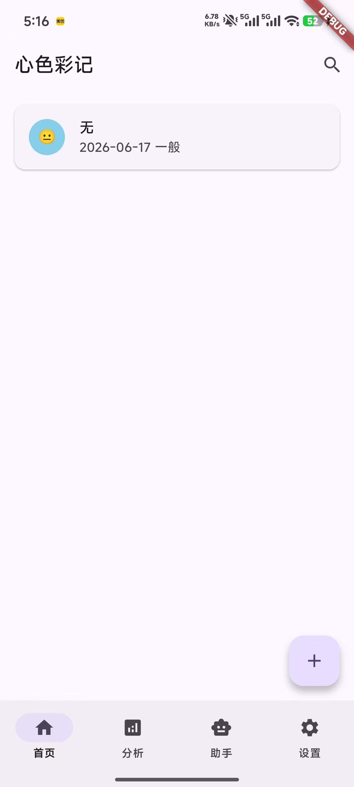
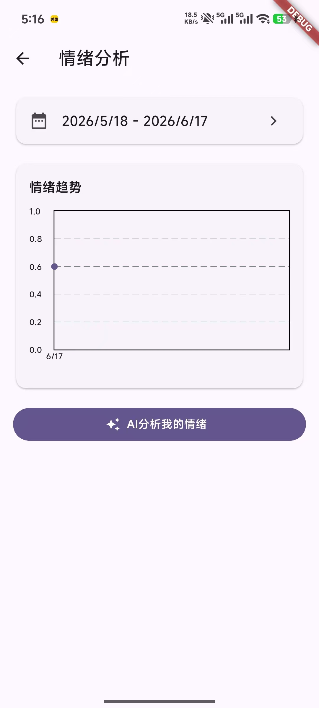
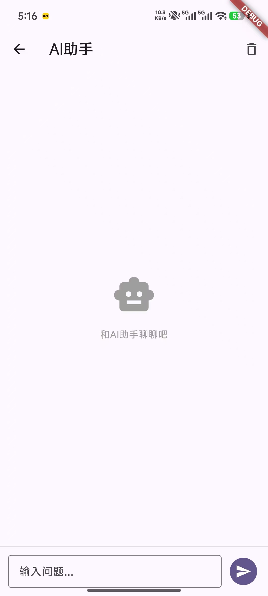
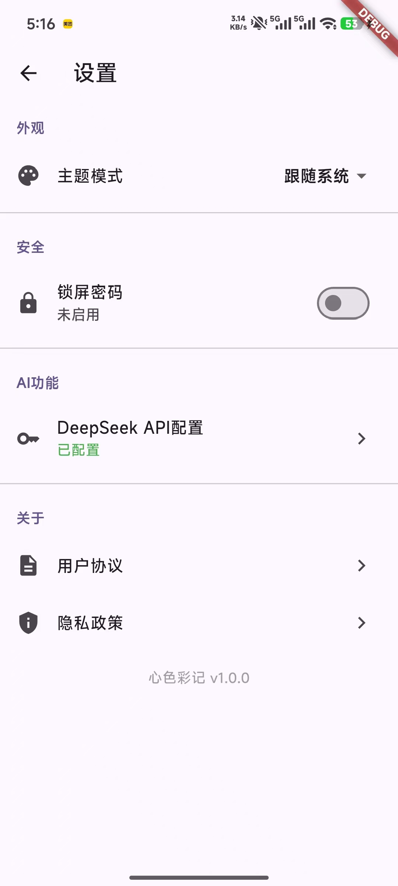

# 心色彩记 (xin-se-cai-ji)

一款基于 Flutter 开发的情绪日记应用，帮助用户记录每日心情与日记内容，通过情绪趋势分析与 AI 助手了解自身心理状态。

## 功能展示

| 首页 | 情绪分析 | AI 助手 | 设置 |
|:---:|:---:|:---:|:---:|
|  |  |  |  |

## 项目简介

心色彩记是一款专注于情绪记录的日记应用，支持六种情绪状态（😊 开心、 平静、😐 一般、 焦虑、😢 难过、😡 愤怒），用户可以：

- 📝 记录每日日记并选择对应情绪
- 📊 查看情绪趋势折线图，支持自定义日期范围
- 🤖 使用 DeepSeek AI 助手进行情绪疏导与智能对话
-  自定义主题（跟随系统 / 亮色 / 暗色）
- 🔒 可选 PIN 密码锁屏，保护日记隐私
- 💾 全部数据本地存储，不上传服务器

## 技术栈

- **Flutter** 3.29.0+ / **Dart** 3.8.0+
- **GetX** 5.x — 状态管理 + 路由导航
- **Isar** 4.x — NoSQL 本地数据库
- **Dio** 5.x — HTTP 请求（SSE 流式响应）
- **fl_chart** — 情绪趋势图表
- **Material Design 3** — UI 风格

## 核心模块

| 模块 | 说明 |
|------|------|
| 首页（home） | 日记卡片列表，支持搜索、新建、编辑、删除 |
| 编辑页（editor） | 新建/编辑日记，6 种情绪选择，文本输入 |
| 分析页（analyse） | 情绪趋势折线图，日期范围选择，AI 情绪分析 |
| 助手页（assistant） | DeepSeek AI 对话，流式逐字回复 |
| 设置页（settings） | 主题切换、锁屏密码、API Key 配置、法律信息 |
| 锁屏页（lock） | 4~6 位 PIN 密码键盘验证 |
| 协议页（agreement/privacy） | 用户协议与隐私政策 |

## 项目结构

```
lib/
├── api/               # API 层（DeepSeek 对话接口）
├── common/
│   ├── models/        # 数据模型（Diary、DeepSeek）
│   └── values/        # 常量（颜色、键名）
├── pages/             # 8 个页面（view + logic）
├── persistence/       # Isar 数据库 + SharedPreferences
├── router/            # GetX 路由配置
└── utils/             # HTTP 工具、Toast、主题
```

## 开始使用

```bash
# 克隆仓库
git clone https://github.com/s87whu/xin-se-cai-ji.git
cd xin-se-cai-ji

# 安装依赖
flutter pub get

# 生成代码（Isar / JSON 序列化）
dart run build_runner build --delete-conflicting-outputs

# 运行（连接真机或启动模拟器）
flutter run
```

> AI 功能需要在设置页配置 DeepSeek API Key（通过 https://platform.deepseek.com 注册获取）。

